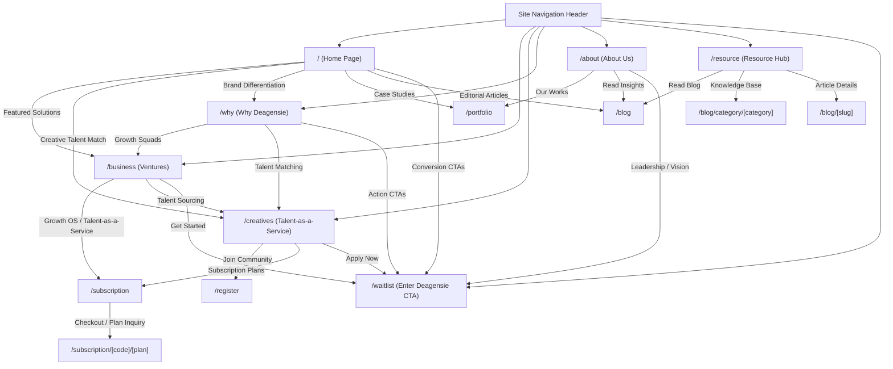

# System Architecture & Technical Documentation - Deagensie Platform

## 1. Executive Summary & Vision

**Deagensie** is a next-generation AI-driven brand engineering ecosystem, predictive marketing intelligence platform, and **Talent-as-a-Service (TaaS)** bridge built to connect African creative talent with global enterprises, scale-ups, and ambitious founders.

The platform serves two primary audiences:
1. **Ventures & Businesses**: Accelerating growth through AI-powered market positioning, investor-ready brand engineering, and on-demand creative squads.
2. **African Creatives**: Providing global career opportunities, competitive income, and career acceleration while keeping talent rooted in their local communities.

---

## 2. Technology Stack & Framework Ecosystem

| Component | Technology | Version / Specification | Role & Usage |
| :--- | :--- | :--- | :--- |
| **Core Framework** | Nuxt 4 | `^4.4.6` | Full-stack Vue SSR/SSG engine, server routing, auto-imports |
| **UI Library** | Vue 3 | `^3.5.34` | Progressive Composition API (`<script setup lang="ts">`) |
| **Router** | Vue Router | `^5.0.7` | File-based routing and transition management |
| **Styling Engine** | Tailwind CSS v4 | `^4.3.0` | Inline design tokens (`@theme inline`), utility classes, dark variant |
| **UI Primitives** | Reka UI & Shadcn Nuxt | `^2.9.7` / `^2.7.3` | Accessible accordions, dialogs, sheets, comboboxes |
| **Iconography** | Iconify Vue | `@iconify/vue ^5.0.1` | Vector icon sets (HugeIcons, Carbon, Fluent, Mingcute, Solar, etc.) |
| **Animations** | Custom Reveal Engine & Embla | `embla-carousel-vue ^8.6.0` | Scroll-reveal directives (`v-reveal`), smooth carousels, marquee |
| **Form Validation** | VeeValidate & Zod | `^4.15.1` / `^4.4.3` | Reactive form state validation, type-safe schemas |
| **Utilities** | VueUse | `^14.3.0` | Media queries, DOM state hooks, element boundary detection |

---

## 3. Design System & Typography Standard

### 3.1 Typography Architecture
Deagensie enforces a strict two-tier typography hierarchy across all screen sizes:

- **Primary Brand Font — `Prata`** (`--font-prata`, CSS class `.font-prata`):
  - **Typeface**: Google Font 'Prata' (Serif).
  - **Usage**: Primary page headlines (`h1`), section titles (`h2`), card titles (`h3`, `h4`), stat callout numbers (`.stat-value`), and high-impact editorial statements.
  - **Design Purpose**: Imparts a sophisticated, high-end, editorial aesthetic inspired by luxury publication design.

- **Secondary Body Font — `Open Sans`** (`--font-open-sans`, CSS class `.font-open-sans`):
  - **Typeface**: Google Font 'Open Sans' (Sans-Serif).
  - **Usage**: Global body copy (`p`), subheadings, list items (`li`), uppercase section badges (`span`), navigation menus, form fields, and UI buttons. Applied globally to `body`.
  - **Design Purpose**: Ensures maximal legibility, crisp rendering, and high accessibility across mobile, tablet, and desktop viewports.

### 3.2 Color System & Utility Classes
- **Primary Navy**: `#04308F` (used for primary brand containers, callout backgrounds, dark headers).
- **Accent Cyan**: `#05DED5` (used for primary interactive buttons, highlight badges, and focus rings).
- **Secondary Teal**: `#026662` (used for deep AI feature cards and dark section surfaces).
- **Surface Grays**: `#FCFCFE`, `#F8FEFE`, `#F6F6F6` (used for card containers and subtle section separation).
- **Fluid Font Scaling**: `font-size: clamp(0.9375rem, 0.875rem + 0.3125vw, 1.0625rem);` for responsive typography across all screen breakpoints.

---

## 4. Directory Structure Breakdown

```
Deagensie-main/
├── app/
│   ├── app.vue                           # Root Vue application wrapper with header, footer, & toast providers
│   ├── assets/
│   │   └── css/
│   │       └── main.css                  # Core CSS design system, font declarations, theme tokens, & animations
│   ├── components/
│   │   ├── BackToTop.vue                 # Floating scroll-to-top component
│   │   ├── SiteHeader/
│   │   │   ├── index.vue                 # Responsive site header wrapper
│   │   │   ├── DesktopNav.vue            # Desktop nav bar with interactive hover dropdowns
│   │   │   └── MobileNav.vue             # Mobile sheet navigation drawer with accordions
│   │   ├── ui/                           # Reusable Shadcn/Reka UI primitives (Accordion, Sheet, Button, etc.)
│   │   └── pages/                        # Page-specific section components
│   │       ├── (home)/                   # Homepage sections 0 to 7 & WorkSlide
│   │       ├── about/                    # About page sections 0 to 6
│   │       ├── blog/                     # Editorial blog cards and article lists
│   │       ├── business/                 # Ventures & business growth solution sections 0 to 6
│   │       ├── contact/                  # Service interest combobox & contact forms
│   │       ├── creatives/                # Creatives TaaS platform sections 0 to 7
│   │       ├── portfolio/                # Portfolio modal showcase & case studies
│   │       ├── register/                 # Multi-step registration components
│   │       ├── resource/                 # Growth resource hub sections
│   │       ├── subscription/             # Subscription pricing matrices & detail views
│   │       ├── waitlist/                 # Waitlist page components
│   │       └── why/                      # Why Deagensie sections 0 to 10
│   ├── pages/                            # Nuxt file-system router pages
│   │   ├── (home)/index.vue              # Homepage route (/)
│   │   ├── about/index.vue               # About route (/about)
│   │   ├── blog/                         # Blog routes (/blog, /blog/[slug], /blog/category/[category])
│   │   ├── business/                     # Business route (/business, /business/solutions)
│   │   ├── contact/index.vue             # Contact route (/contact)
│   │   ├── creatives/                    # Creatives route (/creatives, /creatives/joinCreative)
│   │   ├── portfolio/index.vue           # Portfolio route (/portfolio)
│   │   ├── register/                     # Registration flow (/register, /register/[type]/[step])
│   │   ├── resource/index.vue            # Resource hub route (/resource)
│   │   ├── subscription/                 # Subscription checkout route (/subscription, /subscription/[code])
│   │   ├── waitlist/index.vue            # Lead capture route (/waitlist)
│   │   └── why/index.vue                 # Why Deagensie route (/why)
│   └── utils/
│       └── page-seo.ts                   # Page SEO metadata & OpenGraph generator
├── public/                               # Static assets (logos, images, favicon)
├── ARCHITECTURE.md                        # Platform architecture & system reference document
├── nuxt.config.ts                        # Nuxt build configuration
└── package.json                          # Package dependencies & npm scripts
```

---

## 5. Page Topology & Link Interconnection Graph

The website follows an interconnected hub-and-spoke routing architecture designed to convert visitors into waitlist signups or subscription inquiries:



### Detailed Page Responsibilities & Connectivity Matrix:

| Route Path | Page Title | Primary Function | Inbound Links From | Key Outbound Links |
| :--- | :--- | :--- | :--- | :--- |
| `/` | Home Page | Executive landing page introducing Deagensie's AI growth engine, client results, and core offerings. | Header logo, Footer logo | `/business`, `/creatives`, `/why`, `/about`, `/portfolio`, `/blog`, `/waitlist` |
| `/why` | Why Deagensie | 11-part breakdown of Deagensie's AI capabilities, Growth Lab, African creative power, and value proposition. | Desktop nav dropdown, Mobile nav accordion | `/waitlist`, `/business`, `/creatives` |
| `/business` | Ventures Growth Lab | Detailed breakdown of strategy, brand engineering, marketing, and digital platform services for businesses. | Desktop nav 'Ventures', Mobile nav accordion, Home links | `/subscription`, `/creatives`, `/waitlist` |
| `/creatives` | Talent-as-a-Service | Portal for African creative talent to join the platform and for companies seeking creative teams. | Desktop nav 'Creatives', Mobile nav accordion | `/waitlist`, `/subscription`, `/register` |
| `/about` | About Us | Company story, mission statement, leadership showcase, and ecosystem vision. | Desktop nav 'About Us', Mobile nav accordion | `/portfolio`, `/waitlist` |
| `/resource` | Resource Hub | Central repository for eBooks, guides, whitepapers, and industry intelligence. | Desktop nav 'Resources', Mobile nav accordion | `/blog`, `/blog/category/[category]` |
| `/blog` | Editorial Blog | Editorial article feed with category filtering and featured stories. | Resource Hub, Home section, Desktop nav | `/blog/[slug]`, `/blog/category/[category]` |
| `/portfolio` | Our Portfolio | Work showcases, client success stories, and campaign detail modals. | About page, Home page | `/waitlist`, `/business` |
| `/subscription` | Flexible Subscription | Subscription tiers for GrowthOS and Talent-as-a-Service plans. | Ventures page, Creatives page, Dropdowns | `/subscription/[code]/[plan]`, `/waitlist` |
| `/waitlist` | Enter Deagensie | Central lead capture and user onboarding portal. | Top nav CTA button ("Enter Deagensie"), Page CTAs | `/` |
| `/contact` | Contact Us | Direct contact form and service interest selection. | Footer links, Direct URLs | `/` |

---

## 6. Development, Linting & Build Workflow

- **Development Server**: `pnpm dev` (runs Nuxt 4 development environment).
- **Build Target**: `pnpm build` (compiles production bundle using Nitro engine).
- **Code Quality**: `pnpm validate` (runs Prettier formatting check and ESLint).
- **Git Hooks**: Lefthook automatically executes pre-commit formatting and linting rules prior to commits.
